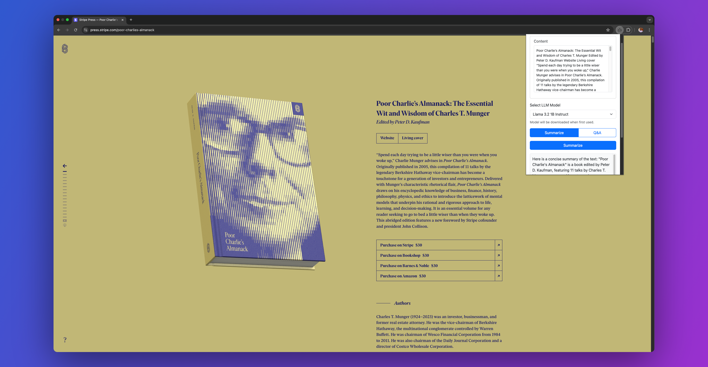

# WebSummarizer Chrome Extension

WebSummarizer is a Chrome extension that uses Large Language Models (LLMs) to provide webpage summarization and Q&A capabilities directly in your browser.


## Features

- Summarize entire webpages
- Ask questions about webpage content with context-aware responses
- Integration with Hugging Face models through WebLLM
- Privacy Preserved - All the processing happens in your browser without ever leaving your machine


## Browser Compatibility Check

The latest Google Chrome provides WebGPU runtime and [WebGPU](https://webgpureport.org/) Report as a useful tool to verify WebGPU capabilities of your browser.


## Adding the extension to chrome

1. Clone this repository or download the source code
2. Install the necessary dependencies:
    ```bash
    npm install 
    ```
3. Build the project:
    ```bash
    npm run build 
    ```
2. Open Chrome and navigate to `chrome://extensions/`
3. Enable "Developer mode" in the top right corner
4. Click "Load unpacked" and select the directory containing the extension files
5. Select `dist` directory from the project

## Usage

1. Click the WebSummarizer icon in your Chrome toolbar to open the extension
2. Select the Desired LLM from the dropdown.
3. Let the extension automatically detect the main content
4. Choose between Summarization and Q&A modes:

### Summarization Mode
- Click the "Summarize" button to generate a concise summary of the content
- The summary will appear in the output section below

### Q&A Mode
- Type your question in the input field
- Click "Ask Question" to get an answer based on the webpage content

## Supported Models

Refer to the [list of models](https://mlc.ai/models) that are available in WebLLM. Add the desired models to `popup.html` and re-build the extension.

## Development

The extension is built using:
- HTML5 and CSS3 with Bootstrap 5.3
- Vanilla JavaScript
- Chrome Extension Manifest V3
- WebLLM for client-side LLM processing

Icon by [SmashIcons](https://www.flaticon.com/authors/smashicons)
